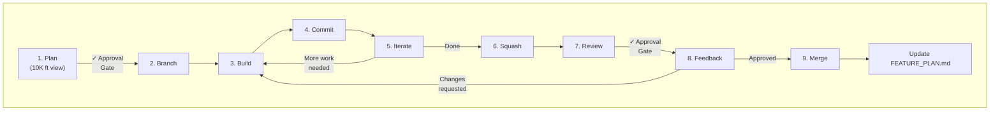

# Claude Project Template

A structured workflow for effective collaboration with Claude Code (or similar AI coding assistants) on larger, multi-session projects.

---

## TL;DR - Quick Start

1. Copy this template to your project root
2. Fill in `CLAUDE.md` with your project context (this is your AI's "memory")
3. List all required reading files in the "Critical Startup Instructions" section of `CLAUDE.md`
4. Follow the 9-step workflow in `docs/process/FEATURE_WORKFLOW.md`
5. Track features in `FEATURE_PLAN.md`, tangents in `TANGENT_TASKS.md`
6. Always work on feature branches, get approval before merging
7. **You** must recognize when work becomes a tangent and tell the AI to document it

**The core principle**: Give the AI persistent context, structured guardrails, and clear approval gates. You stay in control while benefiting from AI assistance.

**New to Claude Code?** See [QUICKSTART.md](QUICKSTART.md) for CLI setup and first steps.

**Want to see a filled-in example?** Check out [examples/filled-django-project/](examples/filled-django-project/) for a complete Django e-commerce example with realistic content.

---

## Why This Exists

Working with AI coding assistants on large projects presents unique challenges:

| Problem | Without Structure | With This Template |
|---------|-------------------|-------------------|
| **Context loss between sessions** | AI forgets everything, you re-explain constantly | `CLAUDE.md` provides persistent context |
| **Scope creep / tangents** | AI chases every side issue, nothing gets finished | `TANGENT_TASKS.md` captures without derailing |
| **Loss of control** | AI makes sweeping changes you didn't want | Approval gates at planning and merge stages |
| **Messy git history** | Random commits, unclear what changed | Feature branches + squash before merge |
| **Repeated mistakes** | AI makes same architectural errors | Key decisions documented in `CLAUDE.md` |
| **Lost context on WHY** | Neither you nor AI remember why decisions were made | Architecture docs capture rationale |

This workflow evolved from real frustration on a multi-month C++ project. It's not theoretical - it solves actual problems.

---

## When To Use This

**Good fit:**
- Multi-session projects (can't complete in one sitting)
- Projects with architectural decisions that matter
- Codebases where you need to maintain quality/consistency
- Any project where you'd use feature branches anyway

**Overkill for:**
- One-off scripts
- Quick prototypes you'll throw away
- Single-session tasks

---

## The Files

### Directory Structure

```
your-project/
├── CLAUDE.md                           # AI's "memory" - read every session
├── docs/
│   ├── process/                        # Workflow and tracking
│   │   ├── FEATURE_WORKFLOW.md         # The 9-step development process
│   │   ├── FEATURE_PLAN.md             # Feature roadmap and status
│   │   ├── TANGENT_TASKS.md            # Side discoveries with breadcrumbs
│   │   └── SESSION_LOG.md              # Historical session work
│   ├── architecture/                   # Technical decisions
│   │   ├── DECISIONS.md                # Architectural decision log (ADRs)
│   │   └── [project-specific].md       # Your architecture docs
│   └── reference/                      # Stable reference material
│       ├── CONVENTIONS.md              # Coding patterns and standards
│       ├── BUILD.md                    # Build, test, run commands
│       └── STRUCTURE.md                # Project file organization
└── LICENSE
```

---

### `CLAUDE.md` (Project Root) - THE STARTING POINT

**This is the most important file.** The AI reads this at the start of EVERY session.

The file is divided into two sections:

**User-Managed (top half)** - You set these up once and update rarely:
- Project overview (what it does, tech stack, architecture)
- Critical startup instructions (what files to read every session)
- Critical rules (ALWAYS/NEVER constraints)

**AI-Managed (bottom half)** - The AI updates these each session:
- Current status (active feature, branch, progress)
- Current feature context (what's done, what remains, key files)
- Known issues & technical debt (with references to TANGENT_TASKS.md)
- Notes for next session (continuity context)

**Keep it concise.** Detailed reference material goes in separate files - conventions, build commands, structure docs. The AI-managed sections should be updated at the end of each session.

---

### Process Files (`docs/process/`)

#### `FEATURE_WORKFLOW.md`
The 9-step process for implementing features. Read once, reference as needed.

#### `FEATURE_PLAN.md`
Your feature roadmap:
- **Completed features** with commit references (for context)
- **Current feature** in progress with status
- **Upcoming features** with dependencies and priorities

**Feature IDs**: Use `FEAT-X.Y` format (e.g., `FEAT-1.0`, `FEAT-2.0`). This provides:
- Stable references that don't change if features are renamed
- Insertion slots: `FEAT-1.5` can be added between `FEAT-1.0` and `FEAT-2.0`
- Sub-features with letter suffix: `FEAT-2.0A`, `FEAT-2.0B`
- Clear distinction from tangent IDs

**When to create a new feature:**
- Distinct piece of work with clear scope
- More than trivial effort
- Deserves its own branch and review

**When NOT to create a feature:**
- Typo fixes, single-line changes
- Quick exploratory work you might throw away

#### `TANGENT_TASKS.md`
Captures side discoveries without losing focus:
- Issue/opportunity description
- **Origin feature** (breadcrumb back to what you were doing)
- Priority and status
- Enough context to pick it up later

**Tangent IDs**: Use `TAN-XXX` format (e.g., `TAN-001`, `TAN-015`). This provides:
- Stable references for tracking across sessions
- Easy cross-referencing from CLAUDE.md's "Known Issues" section
- Simple incrementing (no insertion slots needed - tangents aren't sequenced)
- Clear distinction from feature IDs

**Critical: The AI won't know it's in tangent territory.** You must recognize this and tell it. See [Example Scenarios](#example-scenarios) below.

#### `SESSION_LOG.md`
Historical record of session work, read at session start for context:
- What was accomplished
- What was discovered
- Decisions made
- Next steps identified

Keeps recent sessions (5-10), archive older ones as needed. This file is part of mandatory startup reading so the AI understands recent work history.

---

### Architecture Files (`docs/architecture/`)

#### `DECISIONS.md`
Architectural Decision Log using ADR format. For each significant decision:
- **What** was decided
- **Why** this approach was chosen
- **Alternatives** that were considered
- **Why alternatives were rejected**
- **Consequences** of the decision

This serves both you (in 6 months when you forget) and the AI (every session).

#### Project-Specific Docs
Add architecture documentation as your project grows:
- `ARCHITECTURE_OVERVIEW.md` - System design
- `API_DESIGN.md` - API contracts
- `DATA_MODEL.md` - Database/data structures
- etc.

---

### Reference Files (`docs/reference/`)

Stable documentation that rarely changes. Read once, reference as needed.

#### `CONVENTIONS.md`
Coding patterns and standards:
- Naming conventions
- Error handling patterns
- Code organization
- Testing patterns

#### `BUILD.md`
How to build, test, and run the project:
- Prerequisites
- Build commands
- Test commands
- Environment setup

#### `STRUCTURE.md`
Project file organization:
- Directory layout
- Where different types of code belong
- File naming patterns

---

## Example Scenarios

These show real interactions demonstrating how to use this workflow effectively.

### Scenario 1: Starting a New Project

You've just created a new project and want to introduce the AI to your workflow.

```
YOU: I'm starting a new project - a REST API for task management. I want to use
     the structured workflow I have documented. Please read CLAUDE.md first, then
     let's discuss the initial architecture.

AI:  [Reads CLAUDE.md and referenced files]
     I've reviewed your project structure and workflow documentation. I see this
     is a new project with the feature-based workflow. Before we discuss
     architecture, I have a few questions about scope...

YOU: [Answer questions, discuss architecture]

YOU: Great, let's document these architectural decisions. Create an
     ARCHITECTURE_OVERVIEW.md in docs/architecture/ capturing what we discussed,
     including the alternatives we considered and why we chose this approach.

AI:  [Creates architecture doc with decisions and rationale]

YOU: Now let's create the initial feature plan. Based on our discussion,
     I'm thinking FEAT-1.0 is the database schema, FEAT-2.0 is the core
     API endpoints...

AI:  [Helps structure FEATURE_PLAN.md with features, dependencies, priorities]
```

### Scenario 2: Planning Features Together

You have ideas but want to work with the AI to structure them properly.

```
YOU: I want to add user authentication to the project. I'm not sure if this
     should be one feature or multiple. Let's think through this.

AI:  Authentication typically involves several concerns: user registration,
     login/session management, password reset, and authorization/permissions.
     We could structure this as:

     Option A: Single large feature "User Authentication"
     Option B: Split into smaller features:
       - FEAT-5.0: User Registration & Storage
       - FEAT-6.0: Session Management
       - FEAT-7.0: Password Reset Flow
       - FEAT-8.0: Role-Based Permissions

     Option B gives cleaner review boundaries but more overhead...

YOU: Let's go with Option B but combine 5.0 and 6.0 - registration and sessions
     feel related. So three features total.

AI:  That makes sense. Should I update FEATURE_PLAN.md with these three features?
     I'll include the dependencies - it looks like FEAT-5.0 needs to complete
     before FEAT-7.0 or FEAT-8.0 can start.

YOU: Yes, add them to the plan. Mark them as "Planned" status.

AI:  [Updates FEATURE_PLAN.md with new features, dependencies, and status]
```

### Scenario 3: Recognizing and Flagging a Tangent

**This is critical.** The AI won't know it's going off-track. You must recognize it.

```
[You're working on FEAT-3.0: API Endpoints]

AI:  While implementing the /users endpoint, I noticed the error handling is
     inconsistent across the codebase. Some functions return error codes, others
     throw exceptions. Should I standardize this while I'm here?

YOU: Stop - that's a tangent. We're working on FEAT-3.0 (API Endpoints), not
     error handling standardization. Add this to TANGENT_TASKS.md with a
     breadcrumb back to FEAT-3.0, then continue with the endpoint work.

AI:  You're right, I'll document that tangent.

     [Adds to TANGENT_TASKS.md:]
     ### TAN-001: Error Handling Standardization
     **Origin Feature**: FEAT-3.0 - API Endpoints
     **Description**: Inconsistent error handling patterns discovered...
     **Priority**: Medium
     **Status**: Discovered

     Now, continuing with the /users endpoint implementation...
```

### Scenario 4: Intentionally Working on a Tangent

Sometimes tangents are urgent enough to address immediately.

```
YOU: I saw the tangent you logged about error handling. Before we continue with
     FEAT-3.0, I want to address this - inconsistent errors will cause problems
     later. Let's pause FEAT-3.0 and work on this tangent.

AI:  Understood. Should I create a new feature for this, or treat it as a
     quick tangent fix?

YOU: It's significant enough for its own feature. Create FEAT-3.5: Error
     Handling Standardization in the plan, mark FEAT-3.0 as "Paused", and
     update the tangent entry to show it's being addressed.

AI:  [Updates FEATURE_PLAN.md - adds FEAT-3.5, marks FEAT-3.0 as Paused]
     [Updates TANGENT_TASKS.md - marks TAN-001 as "Converted to FEAT-3.5"]

     Ready to start FEAT-3.5. Should I propose a 10K foot view of the
     error handling standardization?

YOU: Yes, let's see the plan.
```

### Scenario 5: Resuming After a Break

You're returning to the project after days/weeks away.

```
YOU: It's been two weeks. Remind me where we left off.

AI:  [Reads CLAUDE.md and required files]

     Based on my review:

     **Last completed**: FEAT-7.0 (Password Reset) - merged in commit abc123
     **Currently in progress**: FEAT-8.0 (Role-Based Permissions)
       - Branch: feature/role-permissions
       - Status: Implementation 60% complete, paused at middleware integration
     **Outstanding tangents**:
       - TAN-002: Database index optimization (from FEAT-6.0, low priority)
       - TAN-003: Logging verbosity config (from FEAT-7.0, medium priority)

     The FEAT-8.0 branch has uncommitted changes. Want me to summarize
     what's there and what remains?

YOU: Yes, and check if the branch is still in sync with main.
```

### Scenario 6: Discovering Something That Changes Architecture

During implementation, you discover a fundamental issue.

```
AI:  I've run into a problem. The current approach of storing sessions in
     memory won't work for the multi-server deployment you mentioned. This
     needs Redis or a database-backed session store.

YOU: That's a significant architecture change. Before we implement anything,
     document this in docs/architecture/. Capture:
     - What we originally planned and why
     - What we discovered
     - The options we have now
     - Your recommendation

     Then we'll discuss before changing any code.

AI:  [Creates/updates architecture doc with full context]

     I've documented the session storage decision. My recommendation is
     Redis because [reasons]. The alternatives I considered were...

YOU: [Reviews doc] I agree with Redis. Update the architecture doc to mark
     this as the decision, then continue with implementation.
```

---

## The Philosophy

### 1. Persistent Context Over Repeated Explanation
Every session starts with the AI reading `CLAUDE.md` and referenced files. This eliminates the "let me explain the project again" overhead.

### 2. Structured Autonomy
The AI can work independently within a feature scope, but cannot merge without your approval. This balances productivity with control.

### 3. Tangent Capture (User-Driven)
The AI will naturally want to fix everything it sees. **You** must recognize when this is scope creep and redirect it to document the tangent instead of pursuing it.

### 4. Document the WHY
Decisions without rationale are useless in 3 months. Architecture docs must capture not just what was decided, but why, and what alternatives were rejected.

### 5. Clean Git History
Feature branches + squash merging means your main branch tells a clear story.

---

## Workflow Overview



---

## Tips for Success

### Keep `CLAUDE.md` Current
Update it at the end of significant sessions. This is your AI's memory - stale memory causes confusion.

### Be Explicit About Tangents
The AI doesn't know it's going off-track. When you see it happening, say clearly: "That's a tangent. Document it and return to [current work]."

### Capture the WHY in Architecture Docs
Every significant decision should have:
- What was decided
- What alternatives existed
- Why this choice was made
- What context led to this

### Use the Review Step
The review isn't bureaucracy - it catches real issues. The AI will make mistakes.

### Right-Size the Process
For trivial changes (typo fixes, single-line changes), skip the full workflow. Use judgment.

---

## What to Commit

Most files in this template should be committed - they're project documentation, not secrets. However, there are important exceptions:

### Always Commit
| File | Why |
|------|-----|
| `CLAUDE.md` | Core project context (but see warning below) |
| `docs/process/FEATURE_WORKFLOW.md` | Process documentation |
| `docs/process/FEATURE_PLAN.md` | Project roadmap - valuable for all contributors |
| `docs/process/TANGENT_TASKS.md` | Technical debt tracking |
| `docs/reference/*` | Project standards and conventions |
| `docs/architecture/*` | Decision records with rationale |

### User Choice
| File | Considerations |
|------|----------------|
| `docs/process/SESSION_LOG.md` | Can get noisy with multiple contributors. Some prefer to keep AI collaboration notes private. Consider `.gitignore` if you want privacy. |

### Never Commit (Security)

**Do NOT put real secrets in `CLAUDE.md` or any tracked file.**

Bad:
```markdown
## Environment Variables
STRIPE_SECRET_KEY=sk_live_abc123realkey...
DATABASE_PASSWORD=supersecret
```

Good:
```markdown
## Environment Variables
See `.env.example` for required variables.
Key variables: DATABASE_URL, REDIS_URL, STRIPE_SECRET_KEY
```

If you need to document environment variables:
- Reference a `.env.example` file (committed, with placeholder values)
- Keep actual secrets in `.env` (gitignored)
- List variable **names** in `CLAUDE.md`, not values

---

## Language-Specific Examples

The `examples/` directory contains ready-to-use reference files for different languages and frameworks:

| Directory | Description |
|-----------|-------------|
| `examples/c/` | C projects (Makefile, GCC/Clang) |
| `examples/cpp/` | C++ projects (CMake, modern C++) |
| `examples/python-lib/` | Python libraries (uv, pytest, ruff) |
| `examples/python-django/` | Django web apps (DRF, Celery) |
| `examples/golang/` | Go projects (modules, golangci-lint) |
| `examples/filled-django-project/` | Complete filled-in example |

Each language example includes:
- **CONVENTIONS.md** - Language-specific coding patterns
- **BUILD.md** - Build, test, and run commands
- **STRUCTURE.md** - Project directory layout

Copy the appropriate example to your `docs/reference/` directory and customize.

---

## Customization

This template is a starting point. Adapt it to your needs:

- **Add sections to `CLAUDE.md`** for project-specific patterns
- **Modify the workflow** if 9 steps is too heavy for your project
- **Add more `docs/architecture/` files** as your project grows
- **Create project-specific templates** in `docs/process/`

---

## License

This template is released under [CC-BY-4.0](https://creativecommons.org/licenses/by/4.0/) with a clarification:

- **Forking/redistributing the template**: Attribution required
- **Using the template in your own project**: No attribution needed

Think of this like a compiler - you don't credit the tool in your output. Copy these files into your project and use the workflow freely. See `LICENSE` for details.

---

## Contributing

If you improve this workflow, consider sharing back:
- Open an issue with your suggestion
- Submit a PR with your enhancement
- Share your experience in discussions

---

## Acknowledgments

This workflow was developed through extensive collaboration with Claude (Anthropic) on a Godot C++ game development project. The patterns emerged from solving real problems over multiple months of development.
